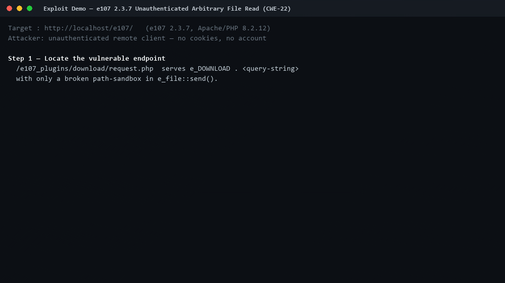
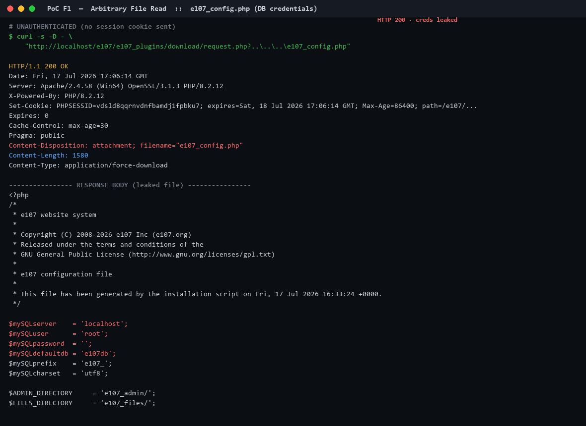
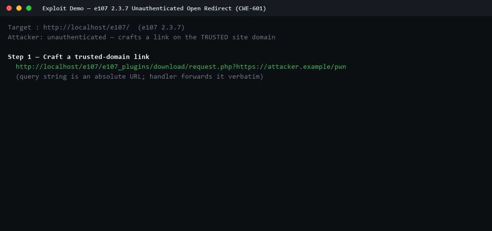

# e107 CMS 2.3.7 — Security Advisories

Verified, reproduced security findings from an **authorized localhost assessment**
of [e107 CMS](https://e107.org) **2.3.7** (PHP 8.2.12, Apache 2.4.58).
Every finding below was exploited end-to-end against a live instance with full
HTTP request/response capture and real-browser confirmation. Nothing is
theoretical.

## Findings

| ID | Vulnerability | CWE | Auth | CVSS v3.1 | Details |
|----|---------------|-----|------|-----------|---------|
| **F1** | Unauthenticated Arbitrary File Read (Path Traversal) | CWE-22 | ❌ None | **7.5 High** | [F1-arbitrary-file-read/](F1-arbitrary-file-read/README.md) |
| **F2** | Unauthenticated Open Redirect | CWE-601 | ❌ None | **6.1 Medium** | [F2-open-redirect/](F2-open-redirect/README.md) |

Both reside in `e107_plugins/download/request.php`; F1's root cause also involves
`e107_handlers/file_class.php :: e_file::send()`.

---

## F1 — Unauthenticated Arbitrary File Read ⭐

Reading `e107_config.php` (database credentials) with a single unauthenticated request:





➡️ **Full write-up:** [F1-arbitrary-file-read/README.md](F1-arbitrary-file-read/README.md)

---

## F2 — Unauthenticated Open Redirect



➡️ **Full write-up:** [F2-open-redirect/README.md](F2-open-redirect/README.md)

---

## Repository layout

```
.
├── README.md                                  # this index
├── e107_2.3.7_Security_Assessment_Report.txt  # full combined assessment report
├── F1-arbitrary-file-read/
│   ├── README.md                              # GitHub write-up (images + gif)
│   ├── cve-request.txt                         # plain-text CVE request (MITRE format)
│   └── evidence/
│       ├── proof_F1_config_read.png
│       ├── proof_F1_outside_webroot.png
│       ├── proof_rootcause.png
│       └── exploit_demo.gif                    # animated PoC
└── F2-open-redirect/
    ├── README.md
    ├── cve-request.txt
    └── evidence/
        ├── proof_F2_open_redirect.png
        └── open_redirect_demo.gif
```

## Test environment

| | |
|---|---|
| Application | e107 CMS **2.3.7** |
| Web server | Apache/2.4.58 (Win64) |
| PHP | 8.2.12 |
| Database | MySQL (`e107db`, prefix `e107_`) |

## Responsible disclosure

All testing was performed exclusively against a local, owner-authorized instance
(`http://localhost/e107/`). No external systems were contacted (the F2 redirect
`Location` header was observed without following it). These advisories are
intended for responsible disclosure to the e107 project.

> ⚠️ For educational and defensive purposes. Do not test against systems you do
> not own or are not explicitly authorized to assess.
